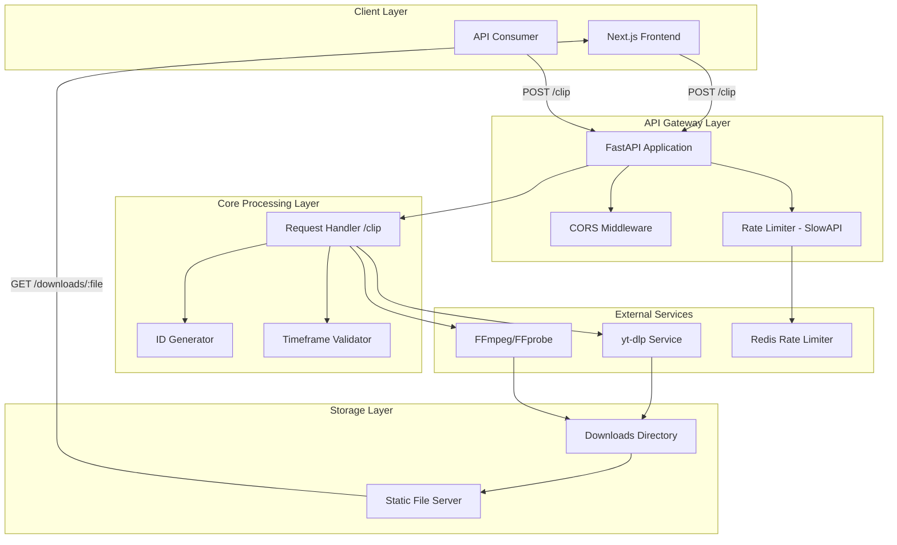
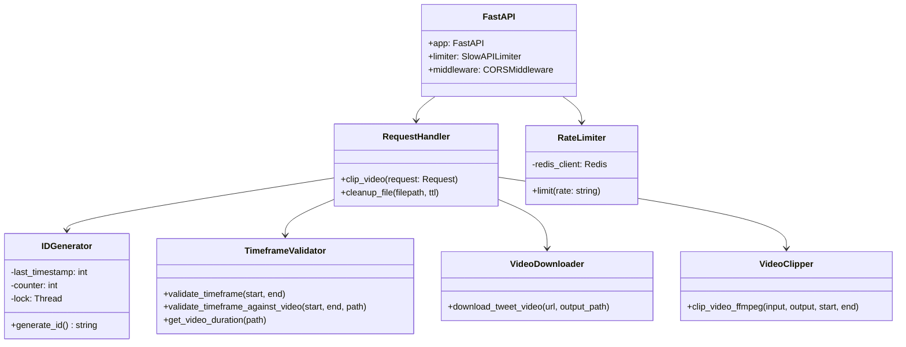
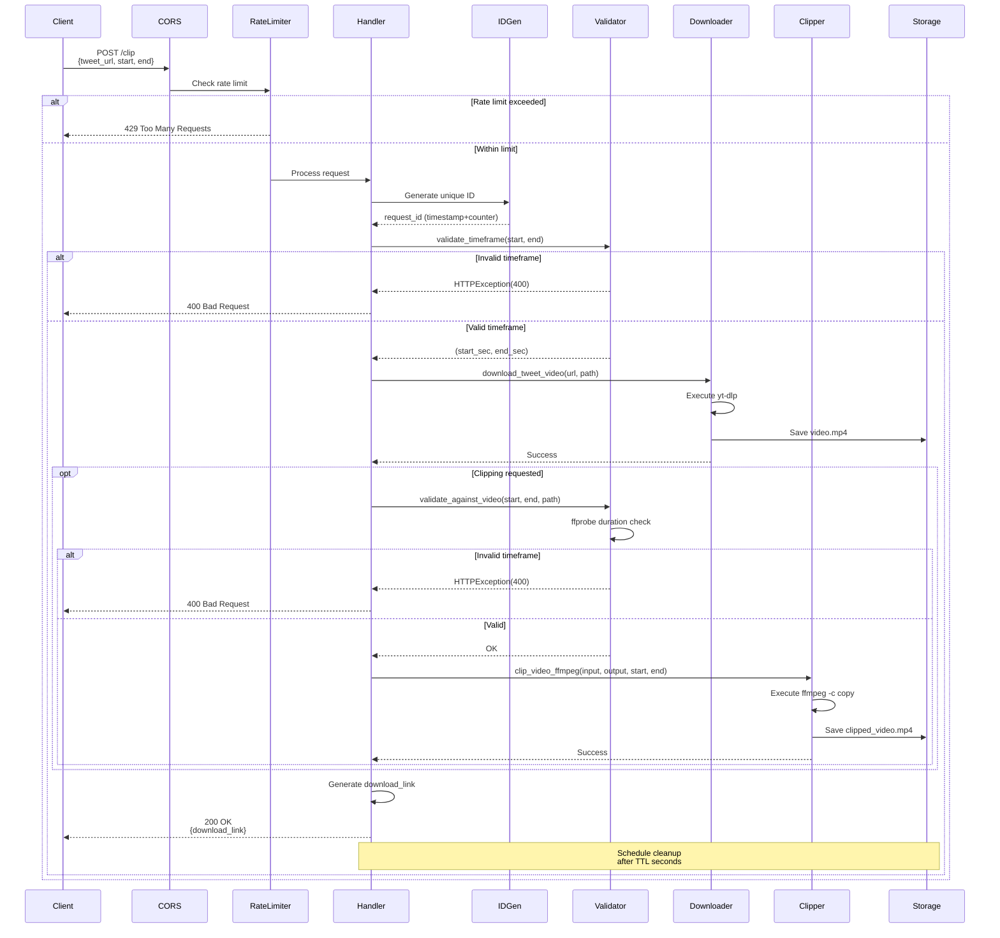
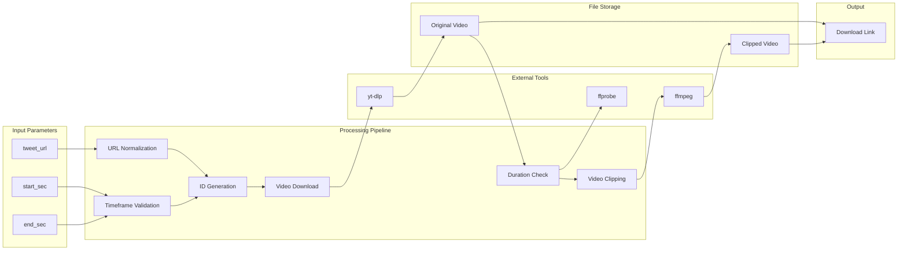
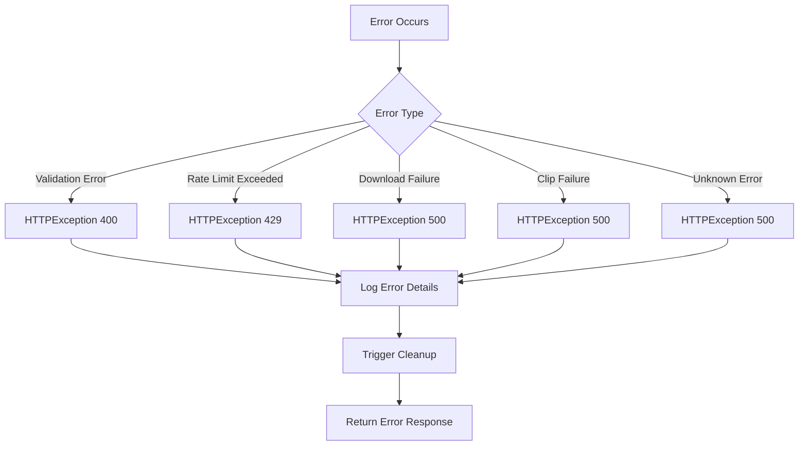

# Video Clipper Architecture Documentation

## Overview

This document describes the architecture and workflow of the Video Clipper project, a FastAPI-based backend service that downloads videos from Twitter/X posts and creates clipped segments based on user-specified timeframes.

## System Architecture



## Component Architecture



## Sequential Workflow

### 1. Request Initiation



### 2. Detailed Step-by-Step Process

#### Step 1: Request Reception & Middleware Processing

**Components Involved:**
- FastAPI Application
- CORS Middleware
- SlowAPI Rate Limiter

**Process Flow:**
1. Client sends POST request to `/clip` endpoint with JSON body:
   ```json
   {
     "tweet_url": "https://x.com/user/status/123456",
     "start": 10.5,
     "end": 25.0
   }
   ```

2. **CORS Middleware** validates origin against `ALLOWED_ORIGINS` environment variable
   - Default: `http://localhost:3000`
   - Supports multiple origins via comma-separated list

3. **Rate Limiter** checks request count:
   - Primary: Redis backend (`REDIS_URL` env var)
   - Fallback: In-memory storage if Redis unavailable
   - Limit: 5 requests per minute per IP address
   - Returns `429 Too Many Requests` if exceeded

#### Step 2: Request Parsing & Validation

**Components Involved:**
- Request Handler (`clip_video`)
- Timeframe Validator (`valid_timeframe.py`)

**Process Flow:**
1. Extract and normalize request parameters:
   - Convert `x.com` URLs to `twitter.com` for yt-dlp compatibility
   - Parse `start` and `end` timestamps

2. **Timeframe Validation Rules:**
   - Both `start` and `end` must be provided together, or both omitted (full video)
   - Values must be finite numeric seconds
   - `start >= 0`, `end > start`
   - Clip duration `(end - start) <= MAX_CLIP_SECONDS` (default: 600s)
   - Absolute times `<= MAX_TIMECODE_SECONDS` (default: 86400s)

3. Environment variables control limits:
   - `MAX_CLIP_SECONDS`: Maximum clip duration
   - `MAX_TIMECODE_SECONDS`: Maximum absolute timestamp

#### Step 3: Unique ID Generation

**Components Involved:**
- ID Generator (`id_generator.py`)

**Algorithm:**
```python
ID Format: {timestamp}{counter:04d}
Example: 17040672000000

- Timestamp: Unix epoch seconds
- Counter: 4-digit zero-padded increment for same-second requests
- Thread-safe with locking mechanism
```

**Purpose:**
- Ensures unique filenames for concurrent requests
- Enables tracking and cleanup of temporary files

#### Step 4: Video Download

**Components Involved:**
- Video Downloader (`download_command.py`)
- yt-dlp external tool

**Process Flow:**
1. Construct yt-dlp command:
   ```bash
   yt-dlp -o {output_path} \
          -f "bestvideo[ext=mp4]+bestaudio[ext=m4a]/mp4" \
          {tweet_url}
   ```

2. Execute asynchronously using `asyncio.create_subprocess_exec`
   - Non-blocking operation
   - Captures stdout/stderr for error reporting

3. Error Handling:
   - subprocess failures raise HTTPException(500)
   - Error messages propagated to client

4. Output: Video saved to `DOWNLOAD_DIR/{request_id}.mp4`

#### Step 5: Timeframe Validation Against Video Duration

**Components Involved:**
- Timeframe Validator (`valid_timeframe.py`)
- FFprobe external tool

**Process Flow:**
1. Query video duration using ffprobe:
   ```bash
   ffprobe -v error \
           -show_entries format=duration \
           -of default=noprint_wrappers=1:nokey=1 \
           {video_path}
   ```

2. Validate requested timeframe:
   - `end_sec <= duration + 1s` (1s buffer for floating-point precision)
   - `start_sec <= duration`

3. Only executed if clipping was requested (start/end provided)

#### Step 6: Video Clipping

**Components Involved:**
- Video Clipper (`clip_from_download.py`)
- FFmpeg external tool

**Process Flow:**
1. Construct ffmpeg command with stream copy (fast, no re-encoding):
   ```bash
   ffmpeg -i {input_path} \
          -ss {start_sec} \
          -to {end_sec} \
          -c copy \
          {output_path}
   ```

2. Execute asynchronously using `asyncio.create_subprocess_exec`
   - Keyframe-accurate clipping
   - Maintains original quality

3. Output: Clipped video saved to `DOWNLOAD_DIR/clipped_{request_id}.mp4`

4. If no clipping requested:
   - Original downloaded video becomes the target file

#### Step 7: Response Generation

**Components Involved:**
- Request Handler
- Static File Server

**Process Flow:**
1. Construct download URL:
   ```python
   base_url = os.getenv("BASE_URL", str(request.base_url).rstrip("/"))
   download_link = f"{base_url}/downloads/{target_filename}"
   ```

2. Return JSON response:
   ```json
   {
     "download_link": "http://server:port/downloads/clipped_17040672000000.mp4"
   }
   ```

3. Static files served via FastAPI's `StaticFiles` middleware
   - Mount point: `/downloads`
   - Directory: `DOWNLOAD_DIR`

#### Step 8: Asynchronous Cleanup

**Components Involved:**
- Cleanup Task (`cleanup_file`)
- asyncio Event Loop

**Process Flow:**
1. Schedule cleanup task in background:
   ```python
   asyncio.create_task(cleanup_file(filepath, DOWNLOAD_TTL_SECONDS))
   ```

2. Wait for TTL period (default: 3600 seconds / 1 hour)

3. Remove temporary files:
   - Original downloaded video
   - Clipped video (if created)

4. Error handling:
   - Failed cleanup logged but doesn't affect client request

## Data Flow Diagram



## Deployment Architecture

```mermaid
graph TB
    subgraph Docker["Docker Container"]
        subgraph App["Application Layer"]
            A1[FastAPI Server]
            A2[Uvicorn ASGI]
        end

        subgraph Deps["Dependencies"]
            D1[yt-dlp]
            D2[FFmpeg]
            D3[FFprobe]
        end

        subgraph Env["Environment"]
            E1[PORT]
            E2[DOWNLOAD_DIR]
            E3[DOWNLOAD_TTL_SECONDS]
            E4[ALLOWED_ORIGINS]
            E5[REDIS_URL]
        end

        subgraph Volumes["Persistent Storage"]
            V1[/app/downloads]
        end
    end

    subgraph External["External Services"]
        R1[Redis Server]
    end

    subgraph Network["Network"]
        N1[Port 8080/9000]
        N2[CORS Origins]
    end

    A2 --> A1
    A1 --> D1
    A1 --> D2
    A1 --> D3
    A1 --> E1
    A1 --> E2
    A1 --> E3
    A1 --> E4
    A1 --> E5
    E5 -.-> R1
    A1 --> V1
    A2 --> N1
    N1 --> N2
```

## Configuration Reference

| Environment Variable | Default | Description |
|---------------------|---------|-------------|
| `PORT` | 9000 | Server listening port |
| `DOWNLOAD_DIR` | /app/downloads | Directory for temporary video files |
| `DOWNLOAD_TTL_SECONDS` | 3600 | Time before file cleanup (1 hour) |
| `ALLOWED_ORIGINS` | http://localhost:3000 | Comma-separated CORS origins |
| `REDIS_URL` | redis://localhost:6379 | Redis connection string for rate limiting |
| `BASE_URL` | Auto-detected | Base URL for download links |
| `MAX_CLIP_SECONDS` | 600 | Maximum clip duration (10 minutes) |
| `MAX_TIMECODE_SECONDS` | 86400 | Maximum absolute timestamp (24 hours) |

## Error Handling Strategy



## Performance Considerations

1. **Async Operations**: All I/O operations (subprocess calls, file operations) use async/await patterns
2. **Stream Copy**: FFmpeg uses `-c copy` for fast clipping without re-encoding
3. **Rate Limiting**: Prevents resource exhaustion with configurable limits
4. **Cleanup Automation**: Automatic file deletion prevents disk space issues
5. **Thread Safety**: ID generator uses locks for concurrent request safety

## Security Features

1. **CORS Protection**: Restricts cross-origin requests to configured origins
2. **Rate Limiting**: Prevents abuse and DoS attacks
3. **Input Validation**: Comprehensive validation of all user inputs
4. **Path Isolation**: Downloads restricted to dedicated directory
5. **Temporary Files**: Automatic cleanup reduces attack surface

## Monitoring & Logging

- Structured logging with timestamps and log levels
- Request processing tracked at INFO level
- Errors logged at ERROR level with stack traces
- Rate limiter events logged for monitoring

---

*Document Version: 1.0*  
*Last Updated: 2024*
