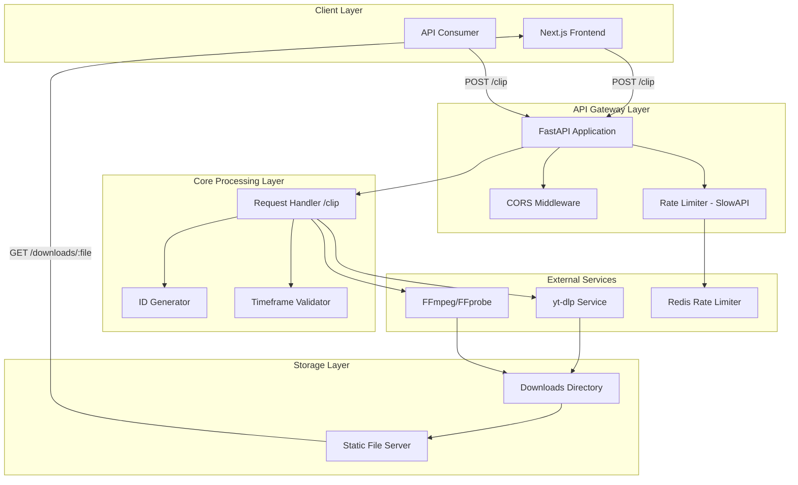
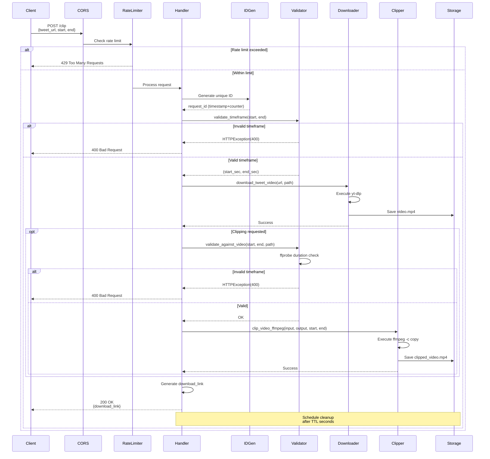
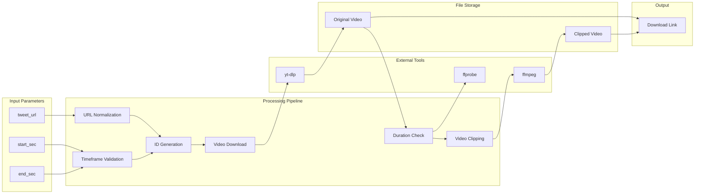
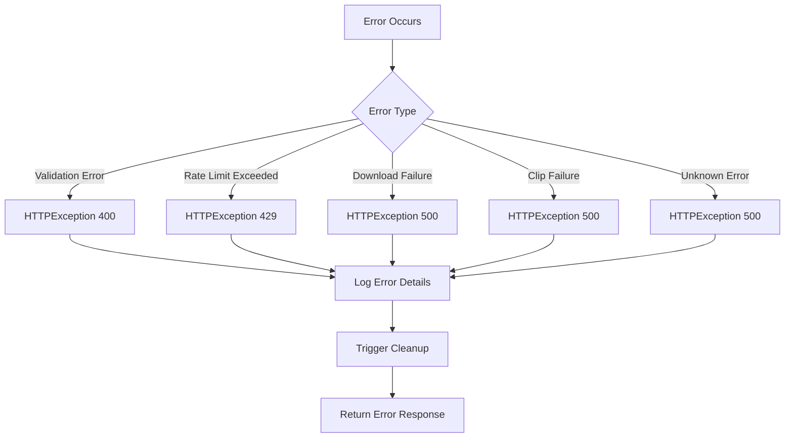
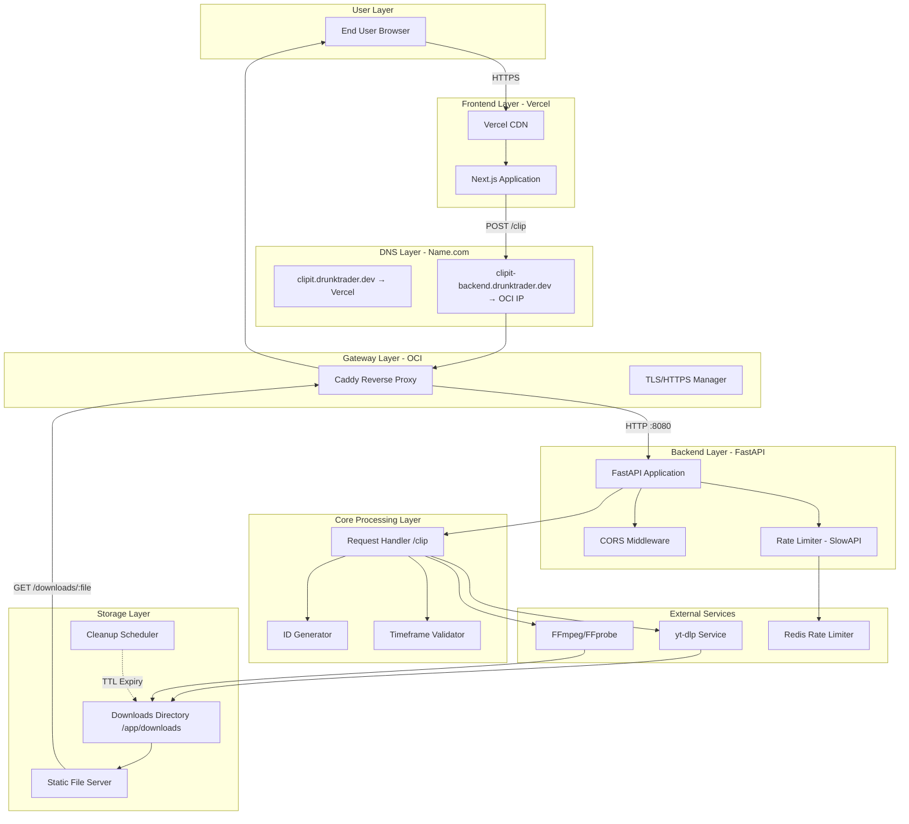
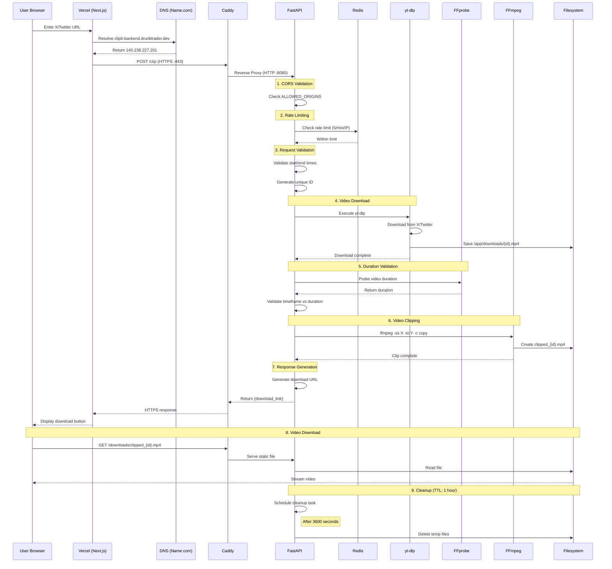
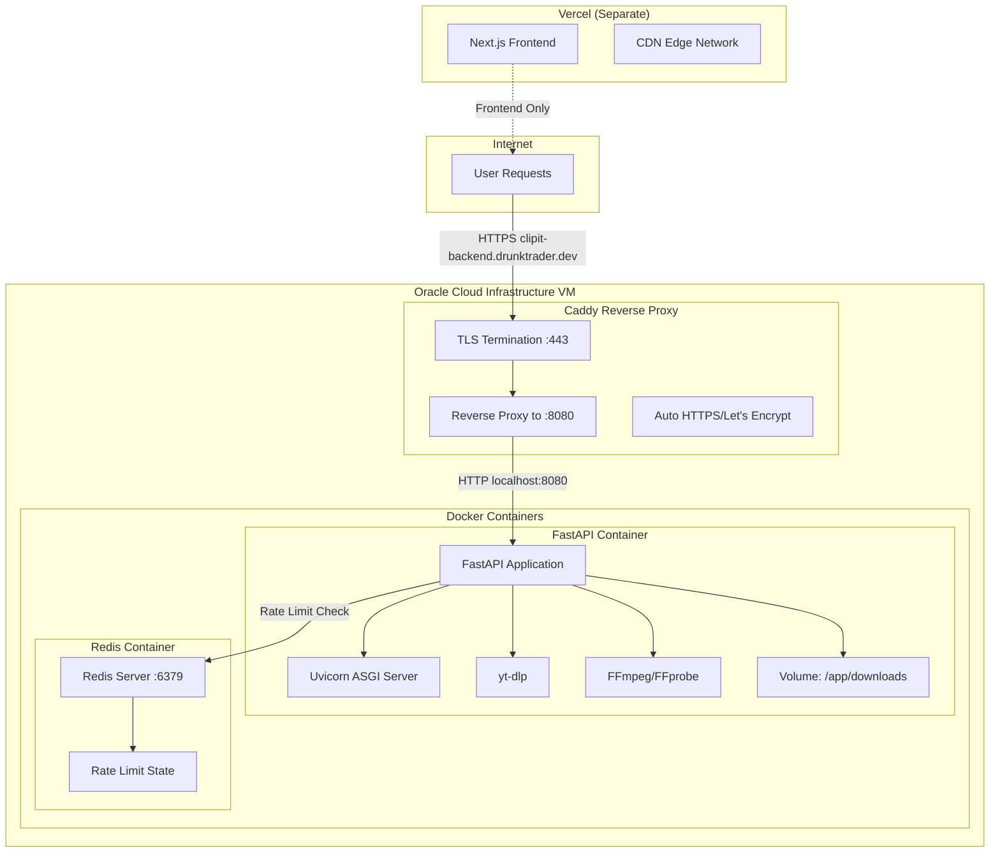

# Video Clipper Architecture Documentation

## Overview

This document describes the architecture and workflow of the Video Clipper project, a FastAPI-based backend service that downloads videos from Twitter/X posts and creates clipped segments based on user-specified timeframes.

## System Architecture



## Component Architecture


## Sequential Workflow

### 1. Request Initiation



### 2. Detailed Step-by-Step Process

#### Step 1: Request Reception & Middleware Processing

**Components Involved:**
- FastAPI Application
- CORS Middleware
- SlowAPI Rate Limiter

**Process Flow:**
1. Client sends POST request to `/clip` endpoint with JSON body:
   ```json
   {
     "tweet_url": "https://x.com/user/status/123456",
     "start": 10.5,
     "end": 25.0
   }
   ```

2. **CORS Middleware** validates origin against `ALLOWED_ORIGINS` environment variable
   - Default: `http://localhost:3000`
   - Supports multiple origins via comma-separated list

3. **Rate Limiter** checks request count:
   - Primary: Redis backend (`REDIS_URL` env var)
   - Fallback: In-memory storage if Redis unavailable
   - Limit: 5 requests per minute per IP address
   - Returns `429 Too Many Requests` if exceeded

#### Step 2: Request Parsing & Validation

**Components Involved:**
- Request Handler (`clip_video`)
- Timeframe Validator (`valid_timeframe.py`)

**Process Flow:**
1. Extract and normalize request parameters:
   - Convert `x.com` URLs to `twitter.com` for yt-dlp compatibility
   - Parse `start` and `end` timestamps

2. **Timeframe Validation Rules:**
   - Both `start` and `end` must be provided together, or both omitted (full video)
   - Values must be finite numeric seconds
   - `start >= 0`, `end > start`
   - Clip duration `(end - start) <= MAX_CLIP_SECONDS` (default: 600s)
   - Absolute times `<= MAX_TIMECODE_SECONDS` (default: 86400s)

3. Environment variables control limits:
   - `MAX_CLIP_SECONDS`: Maximum clip duration
   - `MAX_TIMECODE_SECONDS`: Maximum absolute timestamp

#### Step 3: Unique ID Generation

**Components Involved:**
- ID Generator (`id_generator.py`)

**Algorithm:**
```python
ID Format: {timestamp}{counter:04d}
Example: 17040672000000

- Timestamp: Unix epoch seconds
- Counter: 4-digit zero-padded increment for same-second requests
- Thread-safe with locking mechanism
```

**Purpose:**
- Ensures unique filenames for concurrent requests
- Enables tracking and cleanup of temporary files

#### Step 4: Video Download

**Components Involved:**
- Video Downloader (`download_command.py`)
- yt-dlp external tool

**Process Flow:**
1. Construct yt-dlp command:
   ```bash
   yt-dlp -o {output_path} \
          -f "bestvideo[ext=mp4]+bestaudio[ext=m4a]/mp4" \
          {tweet_url}
   ```

2. Execute asynchronously using `asyncio.create_subprocess_exec`
   - Non-blocking operation
   - Captures stdout/stderr for error reporting

3. Error Handling:
   - subprocess failures raise HTTPException(500)
   - Error messages propagated to client

4. Output: Video saved to `DOWNLOAD_DIR/{request_id}.mp4`

#### Step 5: Timeframe Validation Against Video Duration

**Components Involved:**
- Timeframe Validator (`valid_timeframe.py`)
- FFprobe external tool

**Process Flow:**
1. Query video duration using ffprobe:
   ```bash
   ffprobe -v error \
           -show_entries format=duration \
           -of default=noprint_wrappers=1:nokey=1 \
           {video_path}
   ```

2. Validate requested timeframe:
   - `end_sec <= duration + 1s` (1s buffer for floating-point precision)
   - `start_sec <= duration`

3. Only executed if clipping was requested (start/end provided)

#### Step 6: Video Clipping

**Components Involved:**
- Video Clipper (`clip_from_download.py`)
- FFmpeg external tool

**Process Flow:**
1. Construct ffmpeg command with stream copy (fast, no re-encoding):
   ```bash
   ffmpeg -i {input_path} \
          -ss {start_sec} \
          -to {end_sec} \
          -c copy \
          {output_path}
   ```

2. Execute asynchronously using `asyncio.create_subprocess_exec`
   - Keyframe-accurate clipping
   - Maintains original quality

3. Output: Clipped video saved to `DOWNLOAD_DIR/clipped_{request_id}.mp4`

4. If no clipping requested:
   - Original downloaded video becomes the target file

#### Step 7: Response Generation

**Components Involved:**
- Request Handler
- Static File Server

**Process Flow:**
1. Construct download URL:
   ```python
   base_url = os.getenv("BASE_URL", str(request.base_url).rstrip("/"))
   download_link = f"{base_url}/downloads/{target_filename}"
   ```

2. Return JSON response:
   ```json
   {
     "download_link": "http://server:port/downloads/clipped_17040672000000.mp4"
   }
   ```

3. Static files served via FastAPI's `StaticFiles` middleware
   - Mount point: `/downloads`
   - Directory: `DOWNLOAD_DIR`

#### Step 8: Asynchronous Cleanup

**Components Involved:**
- Cleanup Task (`cleanup_file`)
- asyncio Event Loop

**Process Flow:**
1. Schedule cleanup task in background:
   ```python
   asyncio.create_task(cleanup_file(filepath, DOWNLOAD_TTL_SECONDS))
   ```

2. Wait for TTL period (default: 3600 seconds / 1 hour)

3. Remove temporary files:
   - Original downloaded video
   - Clipped video (if created)

4. Error handling:
   - Failed cleanup logged but doesn't affect client request

## Data Flow Diagram



## Deployment Architecture

```mermaid
graph TB
    subgraph Docker["Docker Container"]
        subgraph App["Application Layer"]
            A1[FastAPI Server]
            A2[Uvicorn ASGI]
        end

        subgraph Deps["Dependencies"]
            D1[yt-dlp]
            D2[FFmpeg]
            D3[FFprobe]
        end

        subgraph Env["Environment"]
            E1[PORT]
            E2[DOWNLOAD_DIR]
            E3[DOWNLOAD_TTL_SECONDS]
            E4[ALLOWED_ORIGINS]
            E5[REDIS_URL]
        end

        subgraph Volumes["Persistent Storage"]
            V1[/app/downloads]
        end
    end

    subgraph External["External Services"]
        R1[Redis Server]
    end

    subgraph Network["Network"]
        N1[Port 8080/9000]
        N2[CORS Origins]
    end

    A2 --> A1
    A1 --> D1
    A1 --> D2
    A1 --> D3
    A1 --> E1
    A1 --> E2
    A1 --> E3
    A1 --> E4
    A1 --> E5
    E5 -.-> R1
    A1 --> V1
    A2 --> N1
    N1 --> N2
```

## Configuration Reference

| Environment Variable | Default | Description |
|---------------------|---------|-------------|
| `PORT` | 9000 | Server listening port |
| `DOWNLOAD_DIR` | /app/downloads | Directory for temporary video files |
| `DOWNLOAD_TTL_SECONDS` | 3600 | Time before file cleanup (1 hour) |
| `ALLOWED_ORIGINS` | http://localhost:3000 | Comma-separated CORS origins |
| `REDIS_URL` | redis://localhost:6379 | Redis connection string for rate limiting |
| `BASE_URL` | Auto-detected | Base URL for download links |
| `MAX_CLIP_SECONDS` | 600 | Maximum clip duration (10 minutes) |
| `MAX_TIMECODE_SECONDS` | 86400 | Maximum absolute timestamp (24 hours) |

## Error Handling Strategy



## Performance Considerations

1. **Async Operations**: All I/O operations (subprocess calls, file operations) use async/await patterns
2. **Stream Copy**: FFmpeg uses `-c copy` for fast clipping without re-encoding
3. **Rate Limiting**: Prevents resource exhaustion with configurable limits
4. **Cleanup Automation**: Automatic file deletion prevents disk space issues
5. **Thread Safety**: ID generator uses locks for concurrent request safety

## Security Features

1. **CORS Protection**: Restricts cross-origin requests to configured origins
2. **Rate Limiting**: Prevents abuse and DoS attacks
3. **Input Validation**: Comprehensive validation of all user inputs
4. **Path Isolation**: Downloads restricted to dedicated directory
5. **Temporary Files**: Automatic cleanup reduces attack surface

## Monitoring & Logging

- Structured logging with timestamps and log levels
- Request processing tracked at INFO level
- Errors logged at ERROR level with stack traces
- Rate limiter events logged for monitoring

---

*Document Version: 1.0*
*Last Updated: 2024*


+++ docs/architecture.md (修改后)
# ClipIt Architecture Documentation

## Overview

This document describes the architecture and workflow of ClipIt (formerly Video Clipper), a production-ready split-architecture application. The system consists of a **Next.js frontend hosted on Vercel** and a **FastAPI backend deployed on Oracle Cloud Infrastructure (OCI)**, with Caddy serving as a reverse proxy and TLS terminator.

The backend downloads videos from Twitter/X posts and creates clipped segments based on user-specified timeframes using yt-dlp and FFmpeg.

## Current Deployment Status

**Project Score: 8.5/10** - Production-ready with minor improvements needed

### Deployment Topology

```
┌─────────────────────────────────────────────────────────────────┐
│                         INTERNET                                 │
└─────────────────────────────────────────────────────────────────┘
                              │
              ┌───────────────┴───────────────┐
              │                               │
              ▼                               ▼
    ┌─────────────────┐             ┌─────────────────────┐
    │     Vercel      │             │   Name.com DNS      │
    │   (Frontend)    │             │   (DNS Provider)    │
    │                 │             │                     │
    │ clipit.         │             │ clipit.             │
    │ drunktrader.dev │             │ drunktrader.dev     │
    │                 │             │       │             │
    └────────┬────────┘             │       ├─────────────┘
             │                      │       │
             │                      │       ▼
             │                      │ ┌─────────────────────┐
             │                      │ │ clipit-backend.     │
             │                      │ │ drunktrader.dev     │
             │                      │ │       │             │
             │                      │ │       ▼             │
             │                      │ │  140.238.227.201    │
             │                      │ │   (OCI Public IP)   │
             │                      │ └───────┬─────────────┘
             │                      │         │
             │ POST /clip           │         ▼
             │──────────────────────▶│ ┌─────────────────────┐
             │                      │ │       Caddy         │
             │                      │ │  (Reverse Proxy)    │
             │                      │ │  :443 → :8080       │
             │                      │ │  + TLS/HTTPS        │
             │                      │ └─────────┬───────────┘
             │                      │           │
             │                      │           ▼
             │ GET /downloads/      │ ┌─────────────────────┐
             │◀─────────────────────│ │      FastAPI        │
             │                      │ │    (Port 8080)      │
             │                      │ │                     │
             │                      │ │  ┌───────────────┐  │
             │                      │ │  │    Redis      │  │
             │                      │ │  │ (Rate Limit)  │  │
             │                      │ │  └───────────────┘  │
             │                      │ │                     │
             │                      │ │  ┌───────────────┐  │
             │                      │ │  │   yt-dlp      │  │
             │                      │ │  └───────────────┘  │
             │                      │ │                     │
             │                      │ │  ┌───────────────┐  │
             │                      │ │  │ FFmpeg/FFprobe│  │
             │                      │ │  └───────────────┘  │
             │                      │ │                     │
             │                      │ │  ┌───────────────┐  │
             │                      │ │  │ /app/downloads│  │
             │                      │ │  │ (Temp Store)  │  │
             │                      │ │  └───────────────┘  │
             │                      │ └─────────────────────┘
             │                      │         OCI VM
             ▼                      │
    ┌─────────────────┐             │
    │   Next.js App   │             │
    │   (Browser)     │             │
    └─────────────────┘             └─────────────────────────┘
```

## High-Level Architecture

ClipIt uses a **split frontend/backend architecture**:

- **Frontend**: Next.js application hosted on Vercel at `https://clipit.drunktrader.dev`
- **Backend**: FastAPI application on OCI VM at `https://clipit-backend.drunktrader.dev`
- **Supporting Services**: Redis and video processing tools run in Docker containers on the OCI VM

### Key Architectural Decisions

1. **Separation of Concerns**: Frontend handles UI/UX; backend handles video processing
2. **Edge Hosting**: Vercel provides global CDN for static assets
3. **Compute Proximity**: Backend runs close to video storage to minimize I/O latency
4. **TLS Termination**: Caddy handles HTTPS certificates automatically
5. **Stateless Design**: Videos stored temporarily on filesystem, not in Redis

## System Architecture Diagram



## Component Architecture


## Detailed Request Flow

### Complete Workflow: From User to Download

This section describes the complete journey of a video clip request through the ClipIt architecture.



## Infrastructure Components

### DNS Configuration (Name.com)

The DNS layer routes traffic to the appropriate services:

| Subdomain | Type | Target | Purpose |
|-----------|------|--------|---------|
| `clipit.drunktrader.dev` | CNAME | Vercel | Frontend application |
| `clipit-backend.drunktrader.dev` | A | 140.238.227.201 | Backend API on OCI VM |

### Caddy Reverse Proxy

Caddy serves as the entry point for all backend traffic:

**Configuration Highlights:**
- Listens on port 443 (HTTPS)
- Automatically manages TLS certificates via Let's Encrypt
- Reverse proxies to FastAPI on `127.0.0.1:8080`
- Handles domain-based routing for `clipit-backend.drunktrader.dev`

**Benefits:**
- Zero-config HTTPS
- Automatic certificate renewal
- Simple reverse proxy configuration
- HTTP/2 support out of the box

### Docker Containerization

The backend runs in Docker containers on the OCI VM:

```yaml
Services:
  - fastapi-app: Port 8080
    ├── Python runtime
    ├── FastAPI + Uvicorn
    ├── yt-dlp
    ├── FFmpeg/FFprobe
    └── Volume: /app/downloads

  - redis: Port 6379
    └── Rate limiting state storage
```

**Note:** The Next.js container has been removed from OCI since the frontend now runs on Vercel.

### Redis Role

Redis is used **exclusively for rate limiting state**, not for video storage:

- Stores IP-based request counts
- Maintains sliding window for rate limit calculations
- Default limit: 5 requests per minute per IP
- Falls back to in-memory storage if Redis is unavailable

### Filesystem Storage

Video files are stored temporarily on the OCI VM filesystem:

- Location: `/app/downloads` (inside container)
- Naming: `{timestamp}{counter}.mp4` and `clipped_{timestamp}{counter}.mp4`
- TTL: 3600 seconds (1 hour) before automatic cleanup
- No database tracking - files managed by application logic

## Step-by-Step Processing Pipeline

#### Step 1: Request Reception & Middleware Processing

**Components Involved:**
- FastAPI Application
- CORS Middleware
- SlowAPI Rate Limiter

**Process Flow:**
1. Client sends POST request to `/clip` endpoint with JSON body:
   ```json
   {
     "tweet_url": "https://x.com/user/status/123456",
     "start": 10.5,
     "end": 25.0
   }
   ```

2. **CORS Middleware** validates origin against `ALLOWED_ORIGINS` environment variable
   - Default: `http://localhost:3000`
   - Supports multiple origins via comma-separated list

3. **Rate Limiter** checks request count:
   - Primary: Redis backend (`REDIS_URL` env var)
   - Fallback: In-memory storage if Redis unavailable
   - Limit: 5 requests per minute per IP address
   - Returns `429 Too Many Requests` if exceeded

#### Step 2: Request Parsing & Validation

**Components Involved:**
- Request Handler (`clip_video`)
- Timeframe Validator (`valid_timeframe.py`)

**Process Flow:**
1. Extract and normalize request parameters:
   - Convert `x.com` URLs to `twitter.com` for yt-dlp compatibility
   - Parse `start` and `end` timestamps

2. **Timeframe Validation Rules:**
   - Both `start` and `end` must be provided together, or both omitted (full video)
   - Values must be finite numeric seconds
   - `start >= 0`, `end > start`
   - Clip duration `(end - start) <= MAX_CLIP_SECONDS` (default: 600s)
   - Absolute times `<= MAX_TIMECODE_SECONDS` (default: 86400s)

3. Environment variables control limits:
   - `MAX_CLIP_SECONDS`: Maximum clip duration
   - `MAX_TIMECODE_SECONDS`: Maximum absolute timestamp

#### Step 3: Unique ID Generation

**Components Involved:**
- ID Generator (`id_generator.py`)

**Algorithm:**
```python
ID Format: {timestamp}{counter:04d}
Example: 17040672000000

- Timestamp: Unix epoch seconds
- Counter: 4-digit zero-padded increment for same-second requests
- Thread-safe with locking mechanism
```

**Purpose:**
- Ensures unique filenames for concurrent requests
- Enables tracking and cleanup of temporary files

#### Step 4: Video Download

**Components Involved:**
- Video Downloader (`download_command.py`)
- yt-dlp external tool

**Process Flow:**
1. Construct yt-dlp command:
   ```bash
   yt-dlp -o {output_path} \
          -f "bestvideo[ext=mp4]+bestaudio[ext=m4a]/mp4" \
          {tweet_url}
   ```

2. Execute asynchronously using `asyncio.create_subprocess_exec`
   - Non-blocking operation
   - Captures stdout/stderr for error reporting

3. Error Handling:
   - subprocess failures raise HTTPException(500)
   - Error messages propagated to client

4. Output: Video saved to `DOWNLOAD_DIR/{request_id}.mp4`

#### Step 5: Timeframe Validation Against Video Duration

**Components Involved:**
- Timeframe Validator (`valid_timeframe.py`)
- FFprobe external tool

**Process Flow:**
1. Query video duration using ffprobe:
   ```bash
   ffprobe -v error \
           -show_entries format=duration \
           -of default=noprint_wrappers=1:nokey=1 \
           {video_path}
   ```

2. Validate requested timeframe:
   - `end_sec <= duration + 1s` (1s buffer for floating-point precision)
   - `start_sec <= duration`

3. Only executed if clipping was requested (start/end provided)

#### Step 6: Video Clipping

**Components Involved:**
- Video Clipper (`clip_from_download.py`)
- FFmpeg external tool

**Process Flow:**
1. Construct ffmpeg command with stream copy (fast, no re-encoding):
   ```bash
   ffmpeg -i {input_path} \
          -ss {start_sec} \
          -to {end_sec} \
          -c copy \
          {output_path}
   ```

2. Execute asynchronously using `asyncio.create_subprocess_exec`
   - Keyframe-accurate clipping
   - Maintains original quality

3. Output: Clipped video saved to `DOWNLOAD_DIR/clipped_{request_id}.mp4`

4. If no clipping requested:
   - Original downloaded video becomes the target file

#### Step 7: Response Generation

**Components Involved:**
- Request Handler
- Static File Server

**Process Flow:**
1. Construct download URL:
   ```python
   base_url = os.getenv("BASE_URL", str(request.base_url).rstrip("/"))
   download_link = f"{base_url}/downloads/{target_filename}"
   ```

2. Return JSON response:
   ```json
   {
     "download_link": "http://server:port/downloads/clipped_17040672000000.mp4"
   }
   ```

3. Static files served via FastAPI's `StaticFiles` middleware
   - Mount point: `/downloads`
   - Directory: `DOWNLOAD_DIR`

#### Step 8: Asynchronous Cleanup

**Components Involved:**
- Cleanup Task (`cleanup_file`)
- asyncio Event Loop

**Process Flow:**
1. Schedule cleanup task in background:
   ```python
   asyncio.create_task(cleanup_file(filepath, DOWNLOAD_TTL_SECONDS))
   ```

2. Wait for TTL period (default: 3600 seconds / 1 hour)

3. Remove temporary files:
   - Original downloaded video
   - Clipped video (if created)

4. Error handling:
   - Failed cleanup logged but doesn't affect client request

## Data Flow Diagram


## Production Deployment Architecture

### Current OCI VM Setup

The backend runs on Oracle Cloud Infrastructure with the following topology:



**Important Notes:**
- The Next.js container has been **removed** from OCI since the frontend now runs on Vercel
- Only FastAPI and Redis containers run on the OCI VM
- Caddy runs as a native service on the host (not in Docker)
- All video processing happens inside the FastAPI container

### Environment Configuration

Production environment variables on OCI:

| Variable | Production Value | Purpose |
|----------|------------------|---------|
| `PORT` | 8080 | Internal FastAPI port |
| `ALLOWED_ORIGINS` | `https://clipit.drunktrader.dev` | CORS for Vercel frontend |
| `REDIS_URL` | `redis://redis:6379` | Docker network Redis URL |
| `BASE_URL` | `https://clipit-backend.drunktrader.dev` | Public backend URL |
| `DOWNLOAD_TTL_SECONDS` | 3600 | 1-hour file retention |

## Configuration Reference

| Environment Variable | Default | Description |
|---------------------|---------|-------------|
| `PORT` | 9000 | Server listening port |
| `DOWNLOAD_DIR` | /app/downloads | Directory for temporary video files |
| `DOWNLOAD_TTL_SECONDS` | 3600 | Time before file cleanup (1 hour) |
| `ALLOWED_ORIGINS` | http://localhost:3000 | Comma-separated CORS origins |
| `REDIS_URL` | redis://localhost:6379 | Redis connection string for rate limiting |
| `BASE_URL` | Auto-detected | Base URL for download links |
| `MAX_CLIP_SECONDS` | 600 | Maximum clip duration (10 minutes) |
| `MAX_TIMECODE_SECONDS` | 86400 | Maximum absolute timestamp (24 hours) |

## Error Handling Strategy


## Performance Considerations

1. **Async Operations**: All I/O operations (subprocess calls, file operations) use async/await patterns
2. **Stream Copy**: FFmpeg uses `-c copy` for fast clipping without re-encoding
3. **Rate Limiting**: Prevents resource exhaustion with configurable limits
4. **Cleanup Automation**: Automatic file deletion prevents disk space issues
5. **Thread Safety**: ID generator uses locks for concurrent request safety

## Security Features

1. **CORS Protection**: Restricts cross-origin requests to configured origins
2. **Rate Limiting**: Prevents abuse and DoS attacks
3. **Input Validation**: Comprehensive validation of all user inputs
4. **Path Isolation**: Downloads restricted to dedicated directory
5. **Temporary Files**: Automatic cleanup reduces attack surface

## Monitoring & Logging

- Structured logging with timestamps and log levels
- Request processing tracked at INFO level
- Errors logged at ERROR level with stack traces
- Rate limiter events logged for monitoring

## Architecture Summary

### In One Sentence

**Vercel serves the Next.js UI, the browser sends clipping requests to the OCI-hosted FastAPI backend through Caddy/HTTPS, FastAPI uses Redis for rate limiting and yt-dlp/FFmpeg for video processing, stores temporary results on disk, returns a download URL, and deletes files after the 1-hour TTL.**

### Key Metrics

| Metric | Value | Notes |
|--------|-------|-------|
| Frontend Host | Vercel | Global CDN edge network |
| Backend Host | OCI VM | 140.238.227.201 |
| Max Clip Duration | 600 seconds | 10 minutes |
| File TTL | 3600 seconds | 1 hour |
| Rate Limit | 5 requests/min/IP | Configurable via SlowAPI |
| HTTPS | Automatic | Caddy + Let's Encrypt |